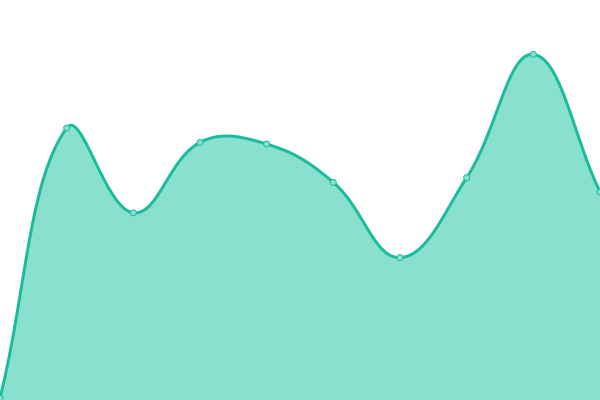
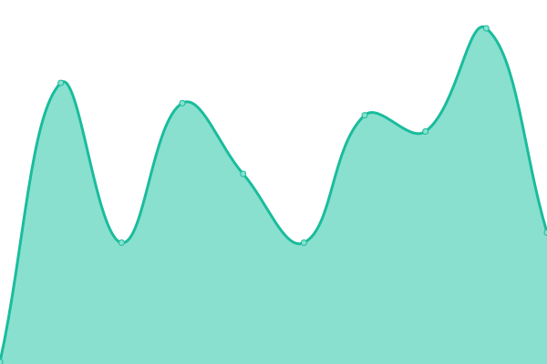
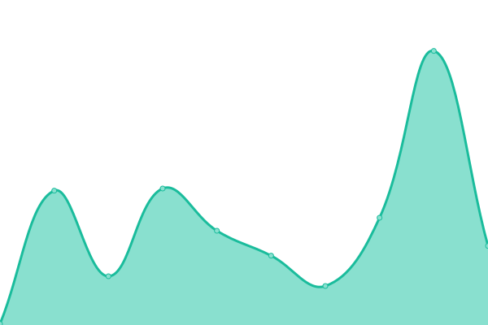
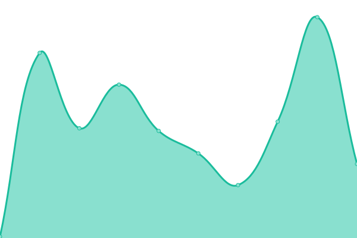

# [📈 Live Status](https://status.qubitpi.org): <!--live status--> **🟩 All systems operational**

This repository contains the open-source uptime monitor and status page for [Jiaqi Liu](www.qubitpi.org), powered by [Upptime](https://github.com/upptime/upptime).

With [Upptime](https://upptime.js.org), you can get your own unlimited and free uptime monitor and status page, powered entirely by a GitHub repository. We use [Issues](https://github.com/QubitPi/documentation-status/issues) as incident reports, [Actions](https://github.com/QubitPi/documentation-status/actions) as uptime monitors, and [Pages](https://status.qubitpi.org) for the status page.

<!--start: status pages-->
<!-- This summary is generated by Upptime (https://github.com/upptime/upptime) -->
<!-- Do not edit this manually, your changes will be overwritten -->
<!-- prettier-ignore -->
| URL | Status | History | Response Time | Uptime |
| --- | ------ | ------- | ------------- | ------ |
|  [Lamassu Machine Learning Library](https://docs.lamassu.dev/en/latest/) | 🟩 Up | [lamassu-machine-learning-library.yml](https://github.com/QubitPi/documentation-status/commits/HEAD/history/lamassu-machine-learning-library.yml) | 

 160ms
     
 | 

<a href="https://status.qubitpi.org/history/lamassu-machine-learning-library">100.00%</a>
    

|  [hashicorp-aws.com](https://hashicorp-aws.com/) | 🟩 Up | [hashicorp-aws-com.yml](https://github.com/QubitPi/documentation-status/commits/HEAD/history/hashicorp-aws-com.yml) | 

 110ms
     
 | 

<a href="https://status.qubitpi.org/history/hashicorp-aws-com">100.00%</a>
    

|  [DockOvpn](https://dockovpn.qubitpi.org/) | 🟩 Up | [dock-ovpn.yml](https://github.com/QubitPi/documentation-status/commits/HEAD/history/dock-ovpn.yml) | 

 244ms
     
 | 

<a href="https://status.qubitpi.org/history/dock-ovpn">100.00%</a>
    

|  [Screwdriver CD Python SDK](https://screwdriver-cd-python-sdk.readthedocs.io/en/latest/) | 🟩 Up | [screwdriver-cd-python-sdk.yml](https://github.com/QubitPi/documentation-status/commits/HEAD/history/screwdriver-cd-python-sdk.yml) | 

 142ms
     
 | 

<a href="https://status.qubitpi.org/history/screwdriver-cd-python-sdk">100.00%</a>
    

|  [Cypress](https://cypress.qubitpi.org/) | 🟩 Up | [cypress.yml](https://github.com/QubitPi/documentation-status/commits/HEAD/history/cypress.yml) | 

 236ms
     
 | 

<a href="https://status.qubitpi.org/history/cypress">100.00%</a>
    

|  [Redux](https://redux.qubitpi.org/) | 🟩 Up | [redux.yml](https://github.com/QubitPi/documentation-status/commits/HEAD/history/redux.yml) | 

 228ms
     
 | 

<a href="https://status.qubitpi.org/history/redux">100.00%</a>
    

|  [React Redux](https://react-redux.qubitpi.org/) | 🟩 Up | [react-redux.yml](https://github.com/QubitPi/documentation-status/commits/HEAD/history/react-redux.yml) | 

 92ms
     
 | 

<a href="https://status.qubitpi.org/history/react-redux">100.00%</a>
    

|  [Redux Toolkit](https://redux-toolkit.qubitpi.org/) | 🟩 Up | [redux-toolkit.yml](https://github.com/QubitPi/documentation-status/commits/HEAD/history/redux-toolkit.yml) | 

 210ms
     
 | 

<a href="https://status.qubitpi.org/history/redux-toolkit">100.00%</a>
    

|  [Immer](https://immer.qubitpi.org/) | 🟩 Up | [immer.yml](https://github.com/QubitPi/documentation-status/commits/HEAD/history/immer.yml) | 

 132ms
     
 | 

<a href="https://status.qubitpi.org/history/immer">100.00%</a>
    

|  [Apollo GraphQL](https://apollographql.qubitpi.org/) | 🟩 Up | [apollo-graph-ql.yml](https://github.com/QubitPi/documentation-status/commits/HEAD/history/apollo-graph-ql.yml) | 

 311ms
     
 | 

<a href="https://status.qubitpi.org/history/apollo-graph-ql">100.00%</a>
    

|  [Logto](https://logto.qubitpi.org/) | 🟩 Up | [logto.yml](https://github.com/QubitPi/documentation-status/commits/HEAD/history/logto.yml) | 

 128ms
     
 | 

<a href="https://status.qubitpi.org/history/logto">100.00%</a>
    

|  [GraphQL Java](https://graphql-java.qubitpi.org/) | 🟩 Up | [graph-ql-java.yml](https://github.com/QubitPi/documentation-status/commits/HEAD/history/graph-ql-java.yml) | 

 89ms
     
 | 

<a href="https://status.qubitpi.org/history/graph-ql-java">100.00%</a>
    

<!--end: status pages-->

[**Visit our status website →**](https://status.qubitpi.org)

## 📄 License

- Powered by: [Upptime](https://github.com/upptime/upptime)
- Code: [MIT](./LICENSE) © [Anand Chowdhary](https://anandchowdhary.com), supported by [Pabio](https://pabio.com)
- Data in the `./history` directory: [Open Database License](https://opendatacommons.org/licenses/odbl/1-0/)
