# [📈 Live Status](https://status.qubitpi.org): <!--live status--> **🟩 All systems operational**

This repository contains the open-source uptime monitor and status page for [Jiaqi Liu](www.qubitpi.org), powered by [Upptime](https://github.com/upptime/upptime).

With [Upptime](https://upptime.js.org), you can get your own unlimited and free uptime monitor and status page, powered entirely by a GitHub repository. We use [Issues](https://github.com/QubitPi/documentation-status/issues) as incident reports, [Actions](https://github.com/QubitPi/documentation-status/actions) as uptime monitors, and [Pages](https://status.qubitpi.org) for the status page.

<!--start: status pages-->
<!-- This summary is generated by Upptime (https://github.com/upptime/upptime) -->
<!-- Do not edit this manually, your changes will be overwritten -->
<!-- prettier-ignore -->
| URL | Status | History | Response Time | Uptime |
| --- | ------ | ------- | ------------- | ------ |
|  [Lamassu Machine Learning Library](https://docs.lamassu.dev/en/latest/) | 🟩 Up | [lamassu-machine-learning-library.yml](https://github.com/QubitPi/documentation-status/commits/HEAD/history/lamassu-machine-learning-library.yml) | 

 695ms
     
 | 

<a href="https://status.qubitpi.org/history/lamassu-machine-learning-library">100.00%</a>
    

|  [MLflow](https://mlflow.qubitpi.org/) | 🟩 Up | [m-lflow.yml](https://github.com/QubitPi/documentation-status/commits/HEAD/history/m-lflow.yml) | 

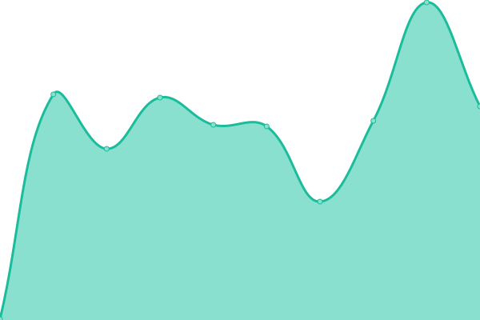 232ms
     
 | 

<a href="https://status.qubitpi.org/history/m-lflow">100.00%</a>
    

|  [OpenAI Spinning Up in Deep RL](https://open-ai-spinningup.qubitpi.org) | 🟩 Up | [open-ai-spinning-up-in-deep-rl.yml](https://github.com/QubitPi/documentation-status/commits/HEAD/history/open-ai-spinning-up-in-deep-rl.yml) | 

 0ms
     
 | 

<a href="https://status.qubitpi.org/history/open-ai-spinning-up-in-deep-rl">100.00%</a>
    

|  [Google Flax](https://google-flax.qubitpi.org/) | 🟩 Up | [google-flax.yml](https://github.com/QubitPi/documentation-status/commits/HEAD/history/google-flax.yml) | 

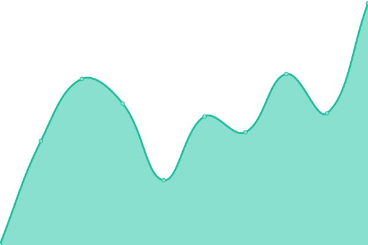 334ms
     
 | 

<a href="https://status.qubitpi.org/history/google-flax">100.00%</a>
    

|  [Google JAX](https://google-jax.qubitpi.org/) | 🟩 Up | [google-jax.yml](https://github.com/QubitPi/documentation-status/commits/HEAD/history/google-jax.yml) | 

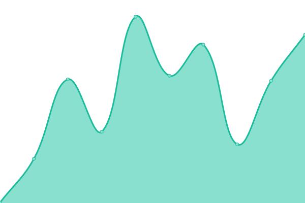 380ms
     
 | 

<a href="https://status.qubitpi.org/history/google-jax">100.00%</a>
    

|  [Jupyter](https://jupyter.qubitpi.org/) | 🟩 Up | [jupyter.yml](https://github.com/QubitPi/documentation-status/commits/HEAD/history/jupyter.yml) | 

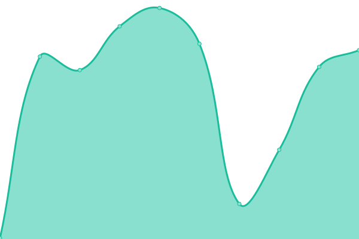 175ms
     
 | 

<a href="https://status.qubitpi.org/history/jupyter">100.00%</a>
    

|  [Jupyter Docs](https://jupyter-docs.qubitpi.org) | 🟩 Up | [jupyter-docs.yml](https://github.com/QubitPi/documentation-status/commits/HEAD/history/jupyter-docs.yml) | 

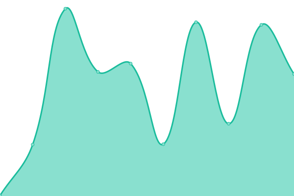 290ms
     
 | 

<a href="https://status.qubitpi.org/history/jupyter-docs">100.00%</a>
    

|  [hashicorp-aws.com](https://hashicorp-aws.com/) | 🟩 Up | [hashicorp-aws-com.yml](https://github.com/QubitPi/documentation-status/commits/HEAD/history/hashicorp-aws-com.yml) | 

 121ms
     
 | 

<a href="https://status.qubitpi.org/history/hashicorp-aws-com">100.00%</a>
    

|  [OpenStack Nova](https://openstack-nova.qubitpi.org/) | 🟩 Up | [open-stack-nova.yml](https://github.com/QubitPi/documentation-status/commits/HEAD/history/open-stack-nova.yml) | 

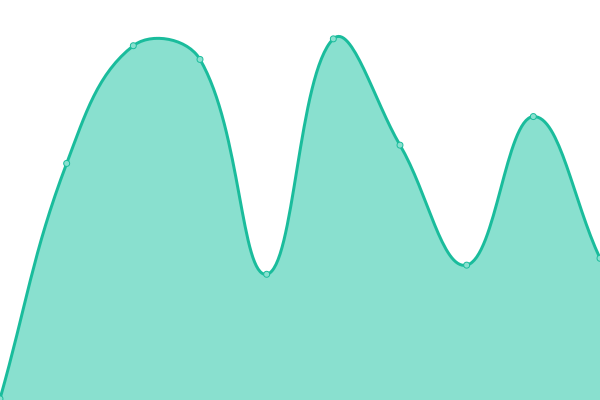 124ms
     
 | 

<a href="https://status.qubitpi.org/history/open-stack-nova">100.00%</a>
    

|  [Stuyding AWS Cloud](https://qubitpi.gitbook.io/learn-cantrill-io-labs) | 🟩 Up | [stuyding-aws-cloud.yml](https://github.com/QubitPi/documentation-status/commits/HEAD/history/stuyding-aws-cloud.yml) | 

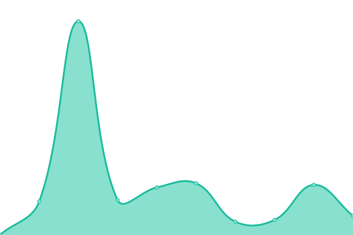 150ms
     
 | 

<a href="https://status.qubitpi.org/history/stuyding-aws-cloud">100.00%</a>
    

|  [DockOvpn](https://dockovpn.qubitpi.org/) | 🟩 Up | [dock-ovpn.yml](https://github.com/QubitPi/documentation-status/commits/HEAD/history/dock-ovpn.yml) | 

 262ms
     
 | 

<a href="https://status.qubitpi.org/history/dock-ovpn">100.00%</a>
    

|  [linuxserver.io](https://linuxserver.qubitpi.org/) | 🟩 Up | [linuxserver-io.yml](https://github.com/QubitPi/documentation-status/commits/HEAD/history/linuxserver-io.yml) | 

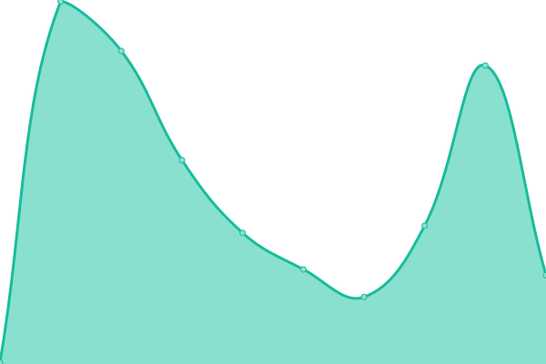 183ms
     
 | 

<a href="https://status.qubitpi.org/history/linuxserver-io">100.00%</a>
    

|  [LinuxServer Documentations](https://linuxserver-docs.qubitpi.org/) | 🟩 Up | [linux-server-documentations.yml](https://github.com/QubitPi/documentation-status/commits/HEAD/history/linux-server-documentations.yml) | 

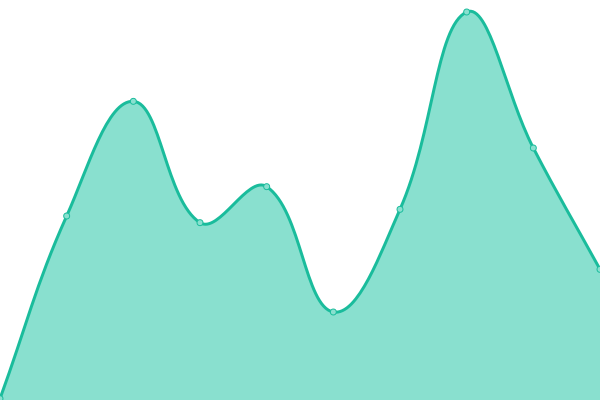 132ms
     
 | 

<a href="https://status.qubitpi.org/history/linux-server-documentations">100.00%</a>
    

|  [Docker Documentations](https://docker.qubitpi.org/) | 🟩 Up | [docker-documentations.yml](https://github.com/QubitPi/documentation-status/commits/HEAD/history/docker-documentations.yml) | 

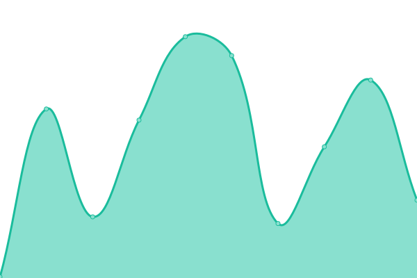 196ms
     
 | 

<a href="https://status.qubitpi.org/history/docker-documentations">100.00%</a>
    

|  [CNCF Distribution](https://distribution.qubitpi.org/) | 🟩 Up | [cncf-distribution.yml](https://github.com/QubitPi/documentation-status/commits/HEAD/history/cncf-distribution.yml) | 

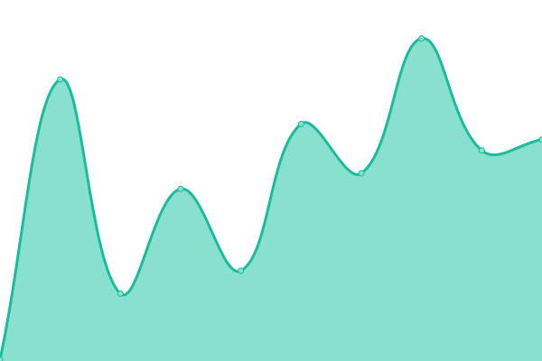 106ms
     
 | 

<a href="https://status.qubitpi.org/history/cncf-distribution">100.00%</a>
    

|  [Screwdriver CD Homepage](https://screwdriver.qubitpi.org/) | 🟩 Up | [screwdriver-cd-homepage.yml](https://github.com/QubitPi/documentation-status/commits/HEAD/history/screwdriver-cd-homepage.yml) | 

 123ms
     
 | 

<a href="https://status.qubitpi.org/history/screwdriver-cd-homepage">100.00%</a>
    

|  [Screwdriver CD Documentations](https://screwdriver-docs.qubitpi.org/) | 🟩 Up | [screwdriver-cd-documentations.yml](https://github.com/QubitPi/documentation-status/commits/HEAD/history/screwdriver-cd-documentations.yml) | 

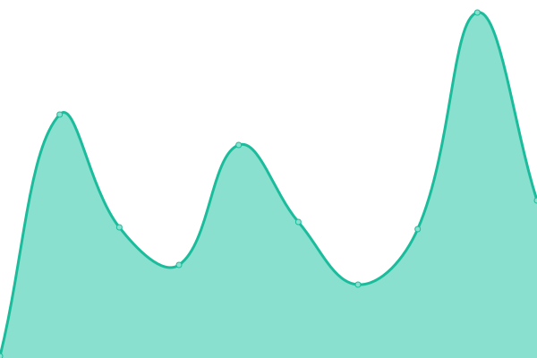 142ms
     
 | 

<a href="https://status.qubitpi.org/history/screwdriver-cd-documentations">100.00%</a>
    

|  [Screwdriver CD Python SDK](https://screwdriver-cd-python-sdk.qubitpi.org) | 🟩 Up | [screwdriver-cd-python-sdk.yml](https://github.com/QubitPi/documentation-status/commits/HEAD/history/screwdriver-cd-python-sdk.yml) | 

 265ms
     
 | 

<a href="https://status.qubitpi.org/history/screwdriver-cd-python-sdk">100.00%</a>
    

|  [Neo4j Browser](https://neo4j-browser.qubitpi.org/) | 🟩 Up | [neo4j-browser.yml](https://github.com/QubitPi/documentation-status/commits/HEAD/history/neo4j-browser.yml) | 

 109ms
     
 | 

<a href="https://status.qubitpi.org/history/neo4j-browser">100.00%</a>
    

|  [Neo4j Movies Graph Example](https://neo4j-graph-examples-movies.qubitpi.org/neo4j-graph-examples-movie/1/movies/) | 🟩 Up | [neo4j-movies-graph-example.yml](https://github.com/QubitPi/documentation-status/commits/HEAD/history/neo4j-movies-graph-example.yml) | 

 140ms
     
 | 

<a href="https://status.qubitpi.org/history/neo4j-movies-graph-example">100.00%</a>
    

|  [React](https://react.qubitpi.org/) | 🟩 Up | [react.yml](https://github.com/QubitPi/documentation-status/commits/HEAD/history/react.yml) | 

 172ms
     
 | 

<a href="https://status.qubitpi.org/history/react">100.00%</a>
    

|  [Cypress](https://cypress.qubitpi.org/) | 🟩 Up | [cypress.yml](https://github.com/QubitPi/documentation-status/commits/HEAD/history/cypress.yml) | 

 88ms
     
 | 

<a href="https://status.qubitpi.org/history/cypress">100.00%</a>
    

|  [Redux](https://redux.qubitpi.org/) | 🟩 Up | [redux.yml](https://github.com/QubitPi/documentation-status/commits/HEAD/history/redux.yml) | 

 118ms
     
 | 

<a href="https://status.qubitpi.org/history/redux">100.00%</a>
    

|  [React Redux](https://react-redux.qubitpi.org/) | 🟩 Up | [react-redux.yml](https://github.com/QubitPi/documentation-status/commits/HEAD/history/react-redux.yml) | 

 113ms
     
 | 

<a href="https://status.qubitpi.org/history/react-redux">100.00%</a>
    

|  [Redux Toolkit](https://redux-toolkit.qubitpi.org/) | 🟩 Up | [redux-toolkit.yml](https://github.com/QubitPi/documentation-status/commits/HEAD/history/redux-toolkit.yml) | 

 138ms
     
 | 

<a href="https://status.qubitpi.org/history/redux-toolkit">100.00%</a>
    

|  [Immer](https://immer.qubitpi.org/) | 🟩 Up | [immer.yml](https://github.com/QubitPi/documentation-status/commits/HEAD/history/immer.yml) | 

 172ms
     
 | 

<a href="https://status.qubitpi.org/history/immer">100.00%</a>
    

|  [Apollo GraphQL](https://apollographql.qubitpi.org/) | 🟩 Up | [apollo-graph-ql.yml](https://github.com/QubitPi/documentation-status/commits/HEAD/history/apollo-graph-ql.yml) | 

 267ms
     
 | 

<a href="https://status.qubitpi.org/history/apollo-graph-ql">100.00%</a>
    

|  [Inversify](https://inversify.qubitpi.org/) | 🟩 Up | [inversify.yml](https://github.com/QubitPi/documentation-status/commits/HEAD/history/inversify.yml) | 

 107ms
     
 | 

<a href="https://status.qubitpi.org/history/inversify">100.00%</a>
    

|  [Logto](https://logto.qubitpi.org/) | 🟩 Up | [logto.yml](https://github.com/QubitPi/documentation-status/commits/HEAD/history/logto.yml) | 

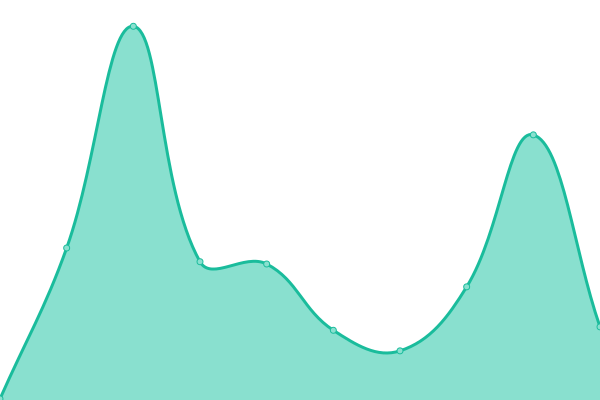 91ms
     
 | 

<a href="https://status.qubitpi.org/history/logto">100.00%</a>
    

|  [JPA Specification](https://jpa.qubitpi.org/) | 🟩 Up | [jpa-specification.yml](https://github.com/QubitPi/documentation-status/commits/HEAD/history/jpa-specification.yml) | 

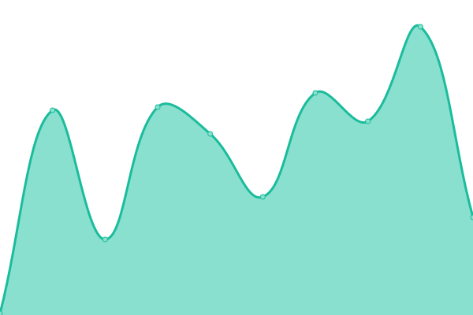 113ms
     
 | 

<a href="https://status.qubitpi.org/history/jpa-specification">100.00%</a>
    

|  [GraphQL Java](https://graphql-java.qubitpi.org/) | 🟩 Up | [graph-ql-java.yml](https://github.com/QubitPi/documentation-status/commits/HEAD/history/graph-ql-java.yml) | 

 85ms
     
 | 

<a href="https://status.qubitpi.org/history/graph-ql-java">100.00%</a>
    

|  [Git](https://git.qubitpi.org/) | 🟩 Up | [git.yml](https://github.com/QubitPi/documentation-status/commits/HEAD/history/git.yml) | 

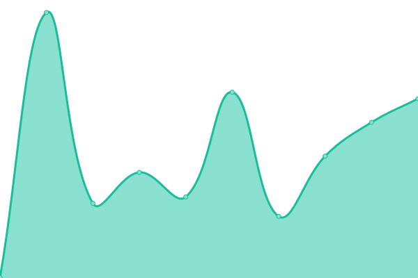 506ms
     
 | 

<a href="https://status.qubitpi.org/history/git">100.00%</a>
    

<!--end: status pages-->

[**Visit our status website →**](https://status.qubitpi.org)

## 📄 License

- Powered by: [Upptime](https://github.com/upptime/upptime)
- Code: [MIT](./LICENSE) © [Anand Chowdhary](https://anandchowdhary.com), supported by [Pabio](https://pabio.com)
- Data in the `./history` directory: [Open Database License](https://opendatacommons.org/licenses/odbl/1-0/)
